# TrustHire AI — Application Flow Document

> **Version:** 1.0.0
> **Created:** 2026-06-19
> **Status:** Active — MVP Phase 1
> **Parent Documents:**
> - [ProjectContext.md](./ProjectContext.md) — Vision, features, tech stack
> - [PRD.md](./PRD.md) — Product requirements (v1.1.0)
> - [TRD.md](./TRD.md) — Technical requirements (v1.0.0)
> - [Schema.md](./Schema.md) — Database schema (v1.0.0)
> **Audience:** Engineering, Design, QA, Product — anyone building or testing the platform

---

## 1. 📋 Document Purpose

This document maps every major user journey and system process in TrustHire AI MVP using Mermaid diagrams. It answers the question: **"What happens when?"** — for every actor, interaction, and AI pipeline in the platform.

---

## 2. 🗺️ Platform Overview — System Context

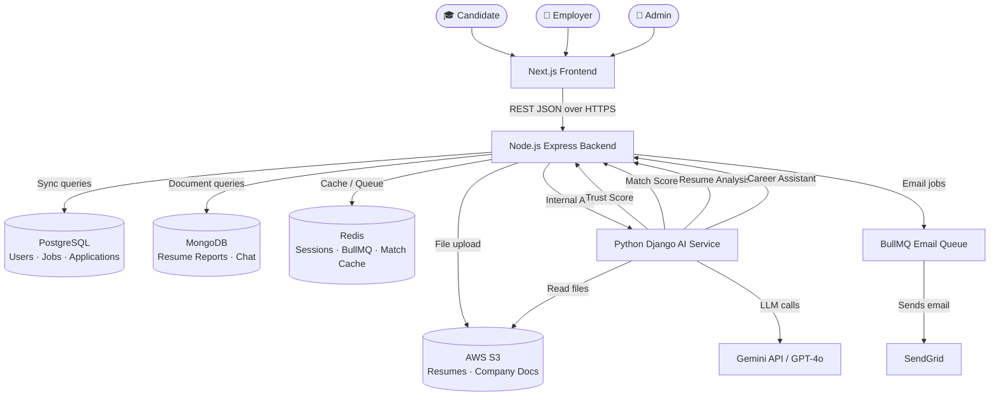

---

## 3. 👤 Candidate Journey

### 3.1 Full Candidate Lifecycle

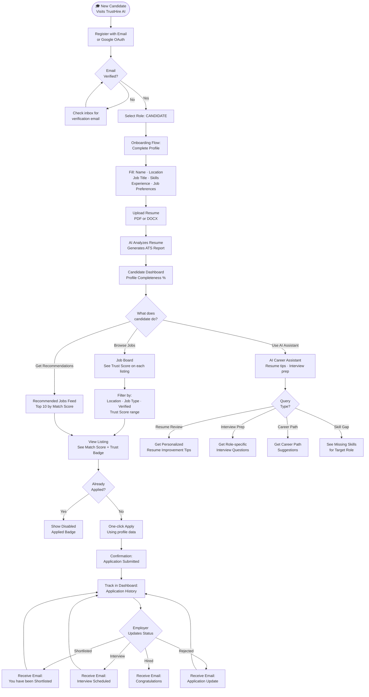

---

### 3.2 Candidate Onboarding Detail

```mermaid
flowchart LR
    A[Land on Homepage] --> B[Click: Get Started]
    B --> C{Choose\nSign-up Method}
    C -->|Email| D[Enter Email + Password\nSelect Role: Candidate]
    C -->|Google| E[Google OAuth\nConsent Screen]

    D --> F[Receive Verification\nEmail within 60 sec]
    F --> G[Click Email Link\nAccount Activated]
    E --> H[Auto-verified\nGo to Role Selection]
    H --> I[Select Role: CANDIDATE]

    G --> J[Onboarding Step 1:\nBasic Info]
    I --> J

    J --> K[Onboarding Step 2:\nSkills + Experience]
    K --> L[Onboarding Step 3:\nJob Preferences]
    L --> M[Onboarding Step 4:\nUpload Resume]

    M --> N{Resume\nUploaded?}
    N -->|Yes| O[AI Analysis Triggered\nReport in 60 sec]
    N -->|Skip| P[Profile Completeness 80%\nPrompt to upload later]

    O --> Q[Dashboard\nProfile Completeness 100%]
    P --> Q
    Q --> R[🎯 Start Browsing Jobs]
```

---

## 4. 🏢 Employer / Recruiter Journey

### 4.1 Full Employer Lifecycle

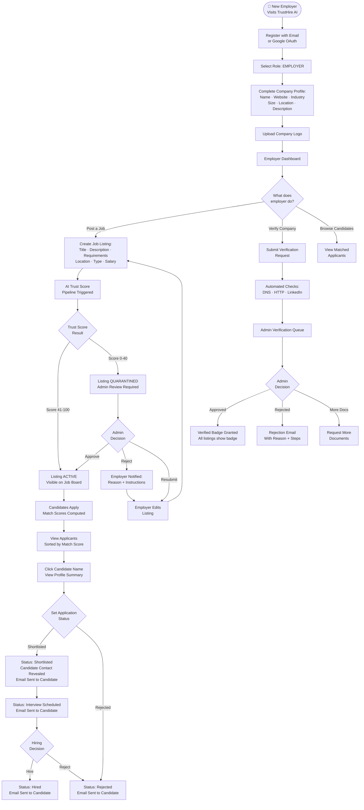

---

### 4.2 Job Posting Flow Detail

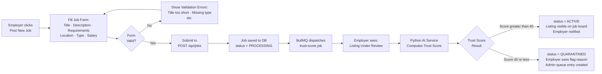

---

## 5. 📄 Resume Upload Flow

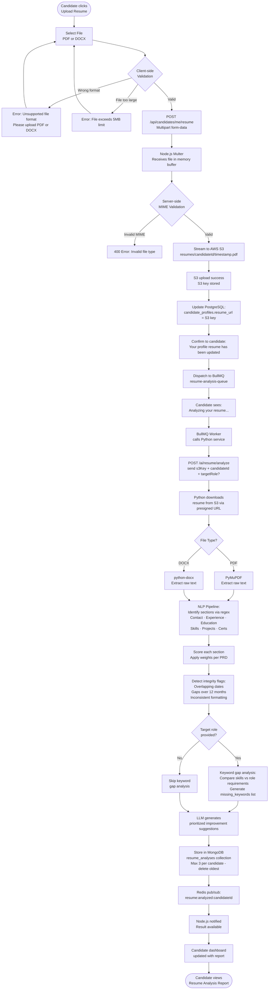

---

## 6. 🤖 ATS Analysis Flow

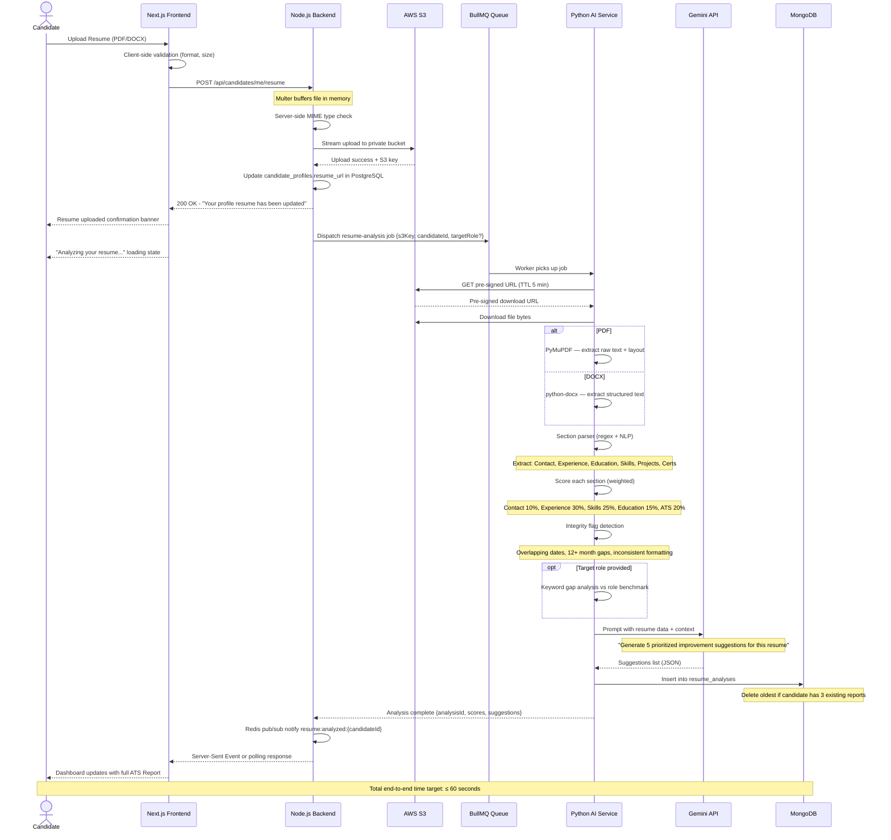

### ATS Score Breakdown (Visual)

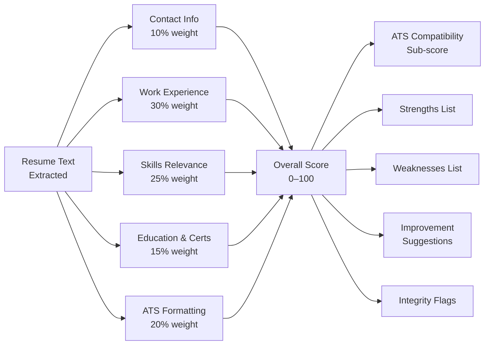

---

## 7. 🔍 Fraud Score (Trust Score) Flow

### 7.1 Overview Flow

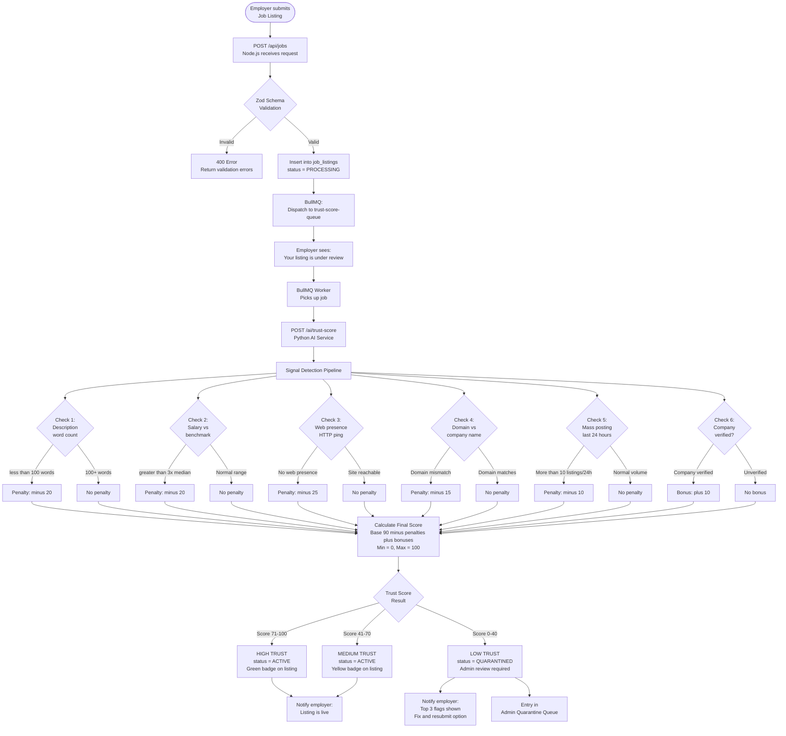

---

### 7.2 Trust Score — Detailed Sequence Diagram

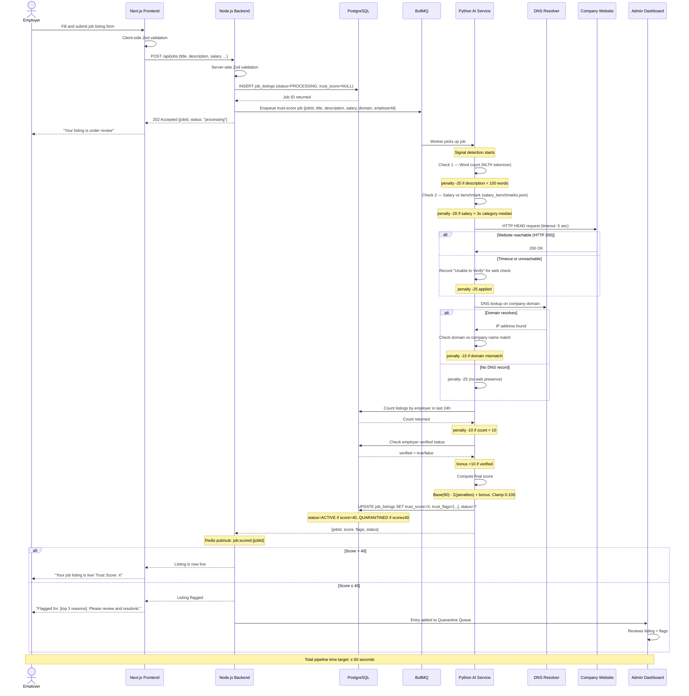

---

### 7.3 Trust Score Calculation — State Diagram

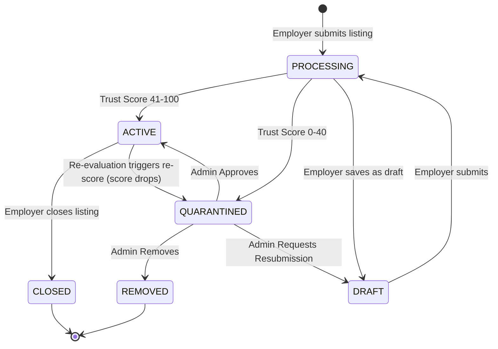

---

## 8. 🤝 Candidate Matching Flow

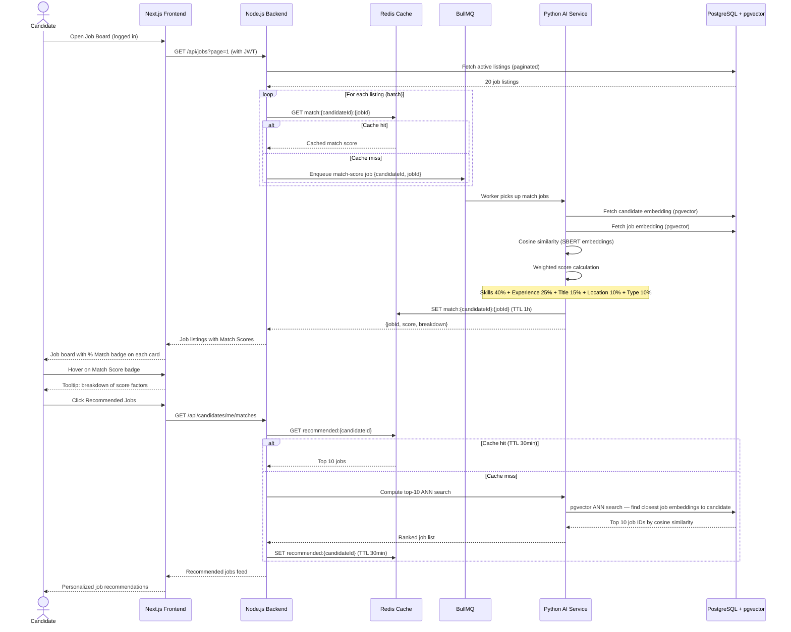

---

## 9. ✅ Company Verification Flow

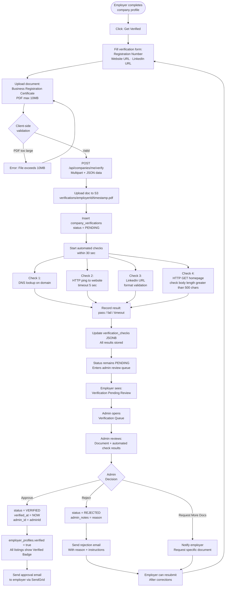

---

## 10. 🤖 AI Career Assistant Flow

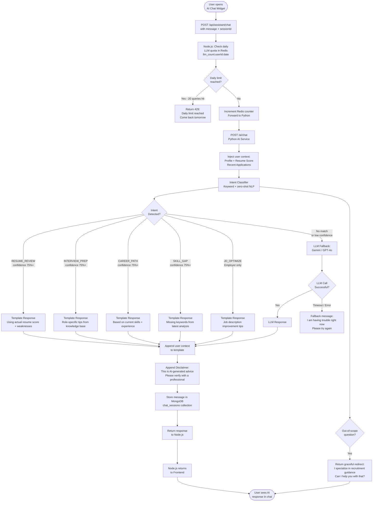

---

## 11. 🔐 Authentication Flow

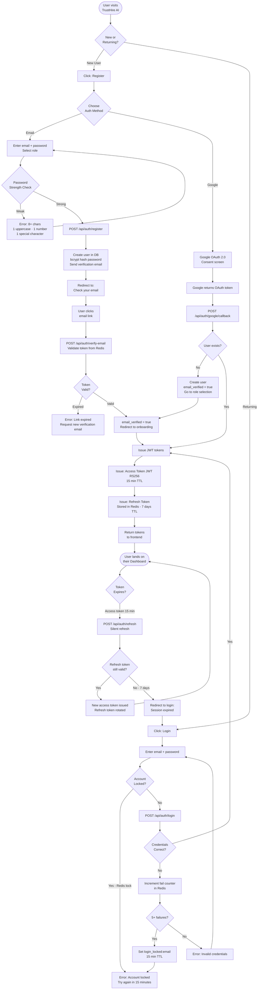

---

## 12. 📊 Application Status Flow

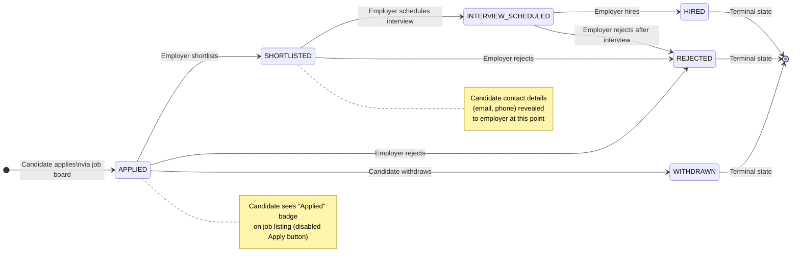

### Email Notifications per Status Change

| Transition | Email Sent To | Subject |
|-----------|--------------|---------|
| Applied → Shortlisted | Candidate | "Great news! You've been shortlisted at [Company]" |
| Applied / Shortlisted → Rejected | Candidate | "Update on your application at [Company]" |
| Shortlisted → Interview Scheduled | Candidate | "Interview scheduled at [Company]" |
| Interview Scheduled → Hired | Candidate | "Congratulations! You've been hired at [Company]" |

---

## 13. 🔄 System Data Flow Summary

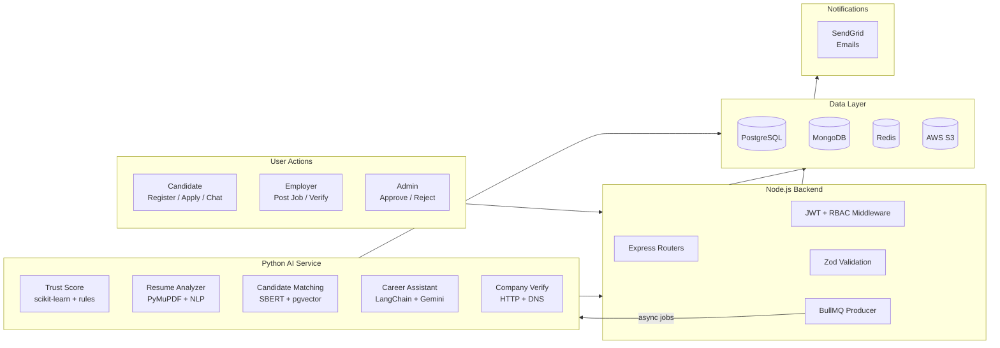

---

## 14. 📁 Related Documents

| Document | Purpose | Status |
|----------|---------|--------|
| [ProjectContext.md](./ProjectContext.md) | Master context, vision, tech stack | ✅ Active (v1.1.0) |
| [PRD.md](./PRD.md) | Product requirements | ✅ Active (v1.1.0) |
| [TRD.md](./TRD.md) | Technical requirements | ✅ Active (v1.0.0) |
| [Schema.md](./Schema.md) | Database schema, ER diagram | ✅ Active (v1.0.0) |
| `APISpec.md` | Full OpenAPI 3.0 specification | 🔲 Pending |
| `UIUXDesign.md` | Wireframes + design system | 🔲 Pending |
| `SecurityPolicy.md` | Auth, privacy, GDPR compliance | 🔲 Pending |

---

*© 2026 TrustHire AI. Confidential — Internal Use Only.*
*AppFlow Version 1.0.0 | Created: 2026-06-19 | Author: Product & Engineering Team*
*References: [ProjectContext.md](./ProjectContext.md) | [PRD.md](./PRD.md) | [TRD.md](./TRD.md) | [Schema.md](./Schema.md)*
