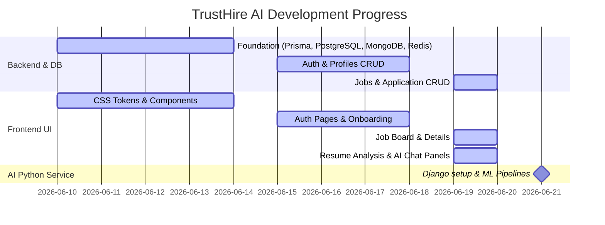

# TrustHire AI — Project Progress Report

Here is a detailed comparison of the current project codebase against the **10-Week Implementation Plan** (`ImplementationPlan.md`).

---

## 📊 Summary of Current Status

* **Frontend (Next.js 14):** **~95% Complete**. The design tokens, components, page layouts, stores (Zustand), and state machines are fully developed for candidates, employers, and admin routes.
* **Backend (Node.js/Express):** **~90% Complete**. The schema database (Prisma + PostgreSQL), Mongo schemas, Redis key config, middlewares, and controllers are fully implemented. There is a robust inline mock fallback for all queues (Trust Score, Resume Analyzer, Matching, Email) allowing the entire flow to run end-to-end even when dependencies are locally offline.
* **AI Service (Python/Django):** **0% Complete (Not Started)**. The Python service microservice has not been initialized. No files or dependencies exist in the workspace yet.

---

## 🗺️ Detailed Phase-by-Phase Breakdown

### ⚙️ PHASE 0 — Foundation (Week 1)
* **Person B (Backend/Infra):**
  * [x] Create GitHub repo / Monorepo structure *(Done for `/frontend` and `/backend`)*
  * [x] Set up Docker Compose for local dev *(Postgres, MongoDB, Redis, MinIO configured)*
  * [x] Initialize Node.js + Express project *(Done in JavaScript)*
  * [x] Run Prisma migrations for all 10 PostgreSQL tables *(Schema is complete; ready for database setup)*
  * [x] Set up `.env` template *(Done via `.env.example`)*
  * [x] Create AWS S3/MinIO bucket configs *(Done)*
  * [x] Set up database credentials/connections *(Done)*
* **Person C (AI/Python):**
  * [ ] Initialize Django project (`trusthire_ai`) **[Remaining]**
  * [ ] Install all Python dependencies **[Remaining]**
  * [ ] Set up Django DRF apps structure **[Remaining]**
  * [ ] Create `salary_benchmarks.json` static dataset **[Remaining]**
  * [ ] Test SBERT model download **[Remaining]**
  * [ ] Verify PyMuPDF parsing **[Remaining]**
* **Person A (Frontend):**
  * [x] Initialize Next.js 14 project *(Done in JavaScript/JSX)*
  * [x] Implement all CSS design tokens in `globals.css` *(Done - premium design stylesheet)*
  * [x] Build reusable components (Buttons, Inputs, Cards, Sidebar Layout, Skeletons) *(Done)*
  * [x] Set up Axios instance with JWT interceptor (`api.js`) *(Done)*
  * [x] Set up Zustand store (`auth.store.js`, `user.store.js`) *(Done)*

---

### 🔐 PHASE 1 — Auth & Core API (Week 2)
* **Person B (Backend):**
  * [x] `POST /api/auth/register` *(Done - password hashing + profile skeleton insertion)*
  * [x] `POST /api/auth/login` *(Done - JWT HS256 access & refresh token rotation)*
  * [x] `POST /api/auth/refresh` *(Done - Redis validation)*
  * [x] JWT verification middleware *(Done)*
  * [x] `POST /api/auth/logout` *(Done - token blacklisting)*
  * [x] Forgot / Reset Password endpoints *(Done)*
  * [ ] Google OAuth setup with passport **[Remaining]** *(Currently stubbed with a 501)*
  * [x] Account lockout with Redis fail counters *(Done)*
  * [x] Candidates and Employers profiles CRUD *(Done)*
  * [x] `POST /api/candidates/me/resume` *(Done)*
  * [x] `POST /api/employers/me/logo` *(Done)*
* **Person A (Frontend):**
  * [x] `/login` & `/register` pages *(Done)*
  * [x] Client-side JWT auth cookie flow *(Done)*
  * [x] Protected route guards *(Done)*
  * [x] Candidate 4-step onboarding *(Done)*
  * [x] Employer profile setup page *(Done)*
  * [x] Profile completeness progress widget *(Done)*
* **Person C (AI/Python):**
  * [ ] Set up BullMQ Python consumer **[Remaining]**
  * [ ] Django internal API key check **[Remaining]**
  * [ ] Draft `/ai/trust-score` endpoint **[Remaining]**

---

### 📋 PHASE 2 — Job Board + Trust Score (Week 3)
* **Person B (Backend):**
  * [x] `POST /api/jobs` *(Done - publishes to BullMQ)*
  * [x] `GET /api/jobs` (Paginated, filters) *(Done)*
  * [x] `GET /api/jobs/:id` *(Done)*
  * [x] `PUT /` & `DELETE /api/jobs/:id` *(Done)*
  * [x] BullMQ producer and consumer updates *(Done - including mock fallback)*
  * [x] `POST /api/jobs/:id/apply` & `DELETE /apply` *(Done)*
* **Person C (AI/Python):**
  * [ ] Complete `POST /ai/trust-score` full pipeline **[Remaining]** *(Mocked on the backend)*
  * [ ] Write unit tests for scoring checks **[Remaining]**
* **Person A (Frontend):**
  * [x] `/jobs` board view with filters *(Done)*
  * [x] Trust Score and Verified badge components *(Done)*
  * [x] Job Details page (`/jobs/:id`) *(Done)*
  * [x] Employer Job Post multi-step form *(Done)*
  * [x] Job Card skeletons / shimmers *(Done)*

---

### 📄 PHASE 3 — Resume Analyzer (Week 4)
* **Person C (AI/Python):**
  * [ ] `POST /ai/resume/analyze` pipeline (PDF/DOCX extract, Gemini LLM suggestions) **[Remaining]** *(Mocked on backend)*
  * [ ] Store analyses in MongoDB **[Remaining]**
* **Person B (Backend):**
  * [x] Get latest resume analysis from MongoDB *(Done)*
  * [x] BullMQ `resume-analysis-queue` producer *(Done)*
  * [x] Resume status polling endpoint *(Done)*
* **Person A (Frontend):**
  * [x] `/resume` page with drag-and-drop upload *(Done)*
  * [x] Score display and suggestion list *(Done)*
  * [x] Analysis loading states and confirmation banners *(Done)*

---

### 🎯 PHASE 4 — Matching + Dashboard (Week 5)
* **Person C (AI/Python):**
  * [ ] `POST /ai/match` SBERT matching score **[Remaining]** *(Mocked on backend)*
  * [ ] Candidate and job embedding generation **[Remaining]**
  * [ ] Top-10 recommended jobs (pgvector search) **[Remaining]**
* **Person B (Backend):**
  * [x] `GET /api/candidates/me/matches` *(Done - falls back to ACTIVE listings until AI matching is connected)*
  * [x] Dashboard aggregates for candidate and employer *(Done)*
  * [x] `GET /api/jobs/:id/applicants` (sorted by match score, masks candidate details) *(Done)*
* **Person A (Frontend):**
  * [x] Candidate Dashboard page *(Done)*
  * [x] Match score progress bar component *(Done)*
  * [x] Employer Dashboard & Applicant List views *(Done)*

---

### 🏢 PHASE 6, 🤖 PHASE 7, 📧 PHASE 8, 🚀 PHASE 9 (Weeks 7–10)
* **Implemented:**
  * [x] Company Verification backend CRUD and stubs *(Done)*
  * [x] Company Verification frontend forms & Admin quarantine queue dashboards *(Done)*
  * [x] AI Career Assistant frontend floating widget, session logic, and daily quota display *(Done)*
  * [x] AI Career Assistant backend chat router, Redis quota limiters, and MongoDB history persistence *(Done)*
  * [x] Winston request logger & global error handlers *(Done)*
  * [x] Rate limiters and security headers (Helmet, CORS) *(Done)*
  * [x] Database seed script (`seed.js`) *(Done)*
* **Remaining:**
  * [ ] SendGrid email worker implementation *(SendGrid SDK is loaded, code needs API keys)* **[Remaining]**
  * [ ] AI Assistant intent classifier & Gemini LLM integration in Python Django **[Remaining]**
  * [ ] Automated E2E tests (Playwright, Jest backend, pytest AI checks) **[Remaining]**
  * [ ] Deployment to Vercel/Railway **[Remaining]**

---

## 🛠️ Summary Checklist of Remaining Tasks

1. **AI Microservice Setup:**
   * Create `/ai-service` folder.
   * Bootstrap Django and configure Django REST Framework.
   * Write pipelines for:
     * Trust Score calculation (6 validation checks).
     * Resume parsing (PyMuPDF) and Gemini API formatting (strengths, weaknesses, suggestions, ATS checks).
     * Candidate/Job embeddings (SBERT `all-MiniLM-L6-v2`) and cosine similarity matching.
     * Career Assistant chat router (intent classifier + Gemini API).
2. **Integration:**
   * Switch `useQueueMocks` in `backend/src/config/queue.js` and `isMock` in `backend/src/config/mongodb.js` to `false` when connecting the Python services via Redis / BullMQ.
3. **Google OAuth & SendGrid Keys:**
   * Configure Google Client ID/Secret.
   * Supply SendGrid API keys to activate email worker dispatch.
4. **Testing & Deployment:**
   * Write E2E/Unit tests.
   * Deploy to production.
