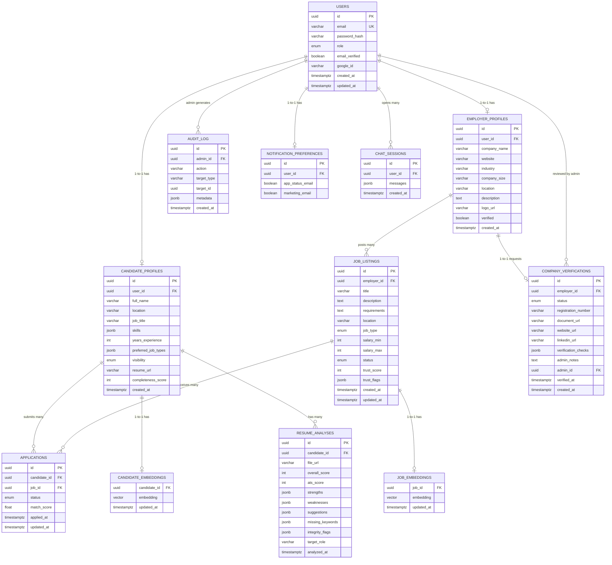

# TrustHire AI — Database Schema Document

> **Version:** 1.0.0
> **Created:** 2026-06-19
> **Status:** Active — MVP Phase 1
> **Parent Documents:**
> - [ProjectContext.md](./ProjectContext.md) — Tech stack, constraints
> - [PRD.md](./PRD.md) — Product requirements (v1.1.0)
> - [TRD.md](./TRD.md) — Technical requirements (v1.0.0)
> **Audience:** Backend Engineers, Database Administrators, QA Engineers
> **Scope:** MVP entities only. All non-MVP features (video interviews, blockchain credentials, salary intelligence) are explicitly excluded.

---

## 1. 📋 Document Purpose

This document defines the complete data schema for TrustHire AI's MVP. It covers:
- **PostgreSQL** — relational data (users, jobs, applications, companies)
- **MongoDB** — unstructured AI outputs (resume analyses, chat sessions)
- **Redis** — ephemeral state (sessions, queues, rate limits, cache)

Every entity here maps to at least one functional requirement in `PRD.md`. No speculative or future-only tables are included.

---

## 2. 🗺️ Database Architecture Overview

| Database | Technology | Host | Entity Count | Primary Use |
|----------|-----------|------|-------------|------------|
| Sole Database | Neon Serverless PostgreSQL 15 + pgvector | Neon Cloud | 12 tables | All structured data, relationships, embeddings, and JSONB documents |
| Cache / Queue | Redis 7 | Upstash | ~10 key patterns | Sessions, queues, rate limits, match cache |
| Object Storage | AWS S3 | AWS | — | Resume PDFs, company documents |

---

## 3. 🔗 ER Diagram



---

## 4. 🐘 PostgreSQL Schema — Table Definitions

---

### 4.1 `users`

**PRD Reference:** FR-AUTH-01, FR-AUTH-02, FR-AUTH-04, FR-ADMIN-01
**Purpose:** Central identity table for all platform users (candidates, employers, admins).

#### Columns

| Column | Type | Nullable | Default | Description |
|--------|------|----------|---------|-------------|
| `id` | `UUID` | NOT NULL | `gen_random_uuid()` | Primary key |
| `email` | `VARCHAR(255)` | NOT NULL | — | Unique email address |
| `password_hash` | `VARCHAR(255)` | NULL | `NULL` | bcrypt hash; NULL for OAuth-only users |
| `role` | `VARCHAR(20)` | NOT NULL | — | `CANDIDATE`, `EMPLOYER`, or `ADMIN` |
| `email_verified` | `BOOLEAN` | NOT NULL | `false` | True after email link clicked |
| `google_id` | `VARCHAR(255)` | NULL | `NULL` | Google OAuth subject ID |
| `created_at` | `TIMESTAMPTZ` | NOT NULL | `NOW()` | Account creation timestamp |
| `updated_at` | `TIMESTAMPTZ` | NOT NULL | `NOW()` | Last update timestamp |

#### DDL

```sql
CREATE TABLE users (
  id              UUID PRIMARY KEY DEFAULT gen_random_uuid(),
  email           VARCHAR(255) NOT NULL,
  password_hash   VARCHAR(255),
  role            VARCHAR(20)  NOT NULL,
  email_verified  BOOLEAN      NOT NULL DEFAULT false,
  google_id       VARCHAR(255),
  created_at      TIMESTAMPTZ  NOT NULL DEFAULT NOW(),
  updated_at      TIMESTAMPTZ  NOT NULL DEFAULT NOW(),

  CONSTRAINT users_email_unique     UNIQUE (email),
  CONSTRAINT users_role_check       CHECK (role IN ('CANDIDATE', 'EMPLOYER', 'ADMIN')),
  CONSTRAINT users_email_format     CHECK (email ~* '^[A-Za-z0-9._%+-]+@[A-Za-z0-9.-]+\.[A-Za-z]{2,}$'),
  CONSTRAINT users_auth_method      CHECK (
    password_hash IS NOT NULL OR google_id IS NOT NULL
  )
);
```

#### Validation Rules

| Rule ID | Field | Rule | Error Message |
|---------|-------|------|---------------|
| VAL-USR-01 | `email` | Valid email format (regex) | "Invalid email address format" |
| VAL-USR-02 | `role` | Must be one of `CANDIDATE`, `EMPLOYER`, `ADMIN` | "Invalid role specified" |
| VAL-USR-03 | `password_hash` + `google_id` | At least one must be non-null | "User must have a password or linked Google account" |
| VAL-USR-04 | `email` | Unique across all users | "An account with this email already exists" |

#### Indexes

```sql
CREATE UNIQUE INDEX idx_users_email    ON users(email);
CREATE INDEX        idx_users_role     ON users(role);
CREATE UNIQUE INDEX idx_users_google   ON users(google_id) WHERE google_id IS NOT NULL;
```

#### Relationships

| Relationship | Type | Child Table | FK Column |
|-------------|------|------------|----------|
| User → Candidate Profile | 1-to-1 | `candidate_profiles` | `candidate_profiles.user_id` |
| User → Employer Profile | 1-to-1 | `employer_profiles` | `employer_profiles.user_id` |
| User → Notification Preferences | 1-to-1 | `notification_preferences` | `notification_preferences.user_id` |
| Admin → Audit Log | 1-to-many | `audit_log` | `audit_log.admin_id` |

---

### 4.2 `candidate_profiles`

**PRD Reference:** FR-CP-01, FR-CP-02, FR-CP-03, FR-CP-04, FR-CP-05
**Purpose:** Extended profile data for CANDIDATE users.

#### Columns

| Column | Type | Nullable | Default | Description |
|--------|------|----------|---------|-------------|
| `id` | `UUID` | NOT NULL | `gen_random_uuid()` | Primary key |
| `user_id` | `UUID` | NOT NULL | — | FK → `users.id` |
| `full_name` | `VARCHAR(255)` | NOT NULL | — | Candidate's full name |
| `location` | `VARCHAR(255)` | NULL | — | City or region |
| `job_title` | `VARCHAR(255)` | NULL | — | Current or desired title |
| `skills` | `JSONB` | NOT NULL | `'[]'` | Array of skill strings |
| `years_experience` | `INT` | NULL | — | Total years of professional experience |
| `preferred_job_types` | `JSONB` | NOT NULL | `'[]'` | Array of job type strings |
| `visibility` | `VARCHAR(10)` | NOT NULL | `'PUBLIC'` | `PUBLIC` or `PRIVATE` |
| `resume_url` | `VARCHAR(500)` | NULL | — | S3 key of active resume file |
| `completeness_score` | `INT` | NOT NULL | `0` | Computed profile completeness (0–100) |
| `created_at` | `TIMESTAMPTZ` | NOT NULL | `NOW()` | — |

#### DDL

```sql
CREATE TABLE candidate_profiles (
  id                  UUID         PRIMARY KEY DEFAULT gen_random_uuid(),
  user_id             UUID         NOT NULL REFERENCES users(id) ON DELETE CASCADE,
  full_name           VARCHAR(255) NOT NULL,
  location            VARCHAR(255),
  job_title           VARCHAR(255),
  skills              JSONB        NOT NULL DEFAULT '[]',
  years_experience    INT,
  preferred_job_types JSONB        NOT NULL DEFAULT '[]',
  visibility          VARCHAR(10)  NOT NULL DEFAULT 'PUBLIC',
  resume_url          VARCHAR(500),
  completeness_score  INT          NOT NULL DEFAULT 0,
  created_at          TIMESTAMPTZ  NOT NULL DEFAULT NOW(),

  CONSTRAINT cp_user_unique          UNIQUE (user_id),
  CONSTRAINT cp_visibility_check     CHECK (visibility IN ('PUBLIC', 'PRIVATE')),
  CONSTRAINT cp_years_exp_check      CHECK (years_experience IS NULL OR years_experience BETWEEN 0 AND 60),
  CONSTRAINT cp_completeness_check   CHECK (completeness_score BETWEEN 0 AND 100)
);
```

#### Completeness Score Calculation

| Field | Weight |
|-------|--------|
| `full_name` | 15% |
| `location` | 10% |
| `job_title` | 15% |
| `skills` (≥ 3 items) | 20% |
| `years_experience` | 10% |
| `preferred_job_types` (≥ 1 item) | 10% |
| `resume_url` (resume uploaded) | 20% |

> Score is recomputed server-side on every profile update. Stored as INT (0–100).

#### Validation Rules

| Rule ID | Field | Rule | Error |
|---------|-------|------|-------|
| VAL-CP-01 | `full_name` | 2–100 characters; no special characters except hyphens and apostrophes | "Full name must be 2–100 characters" |
| VAL-CP-02 | `years_experience` | Integer between 0 and 60 | "Years of experience must be between 0 and 60" |
| VAL-CP-03 | `skills` | JSONB array of strings; each skill max 50 chars | "Each skill must be under 50 characters" |
| VAL-CP-04 | `visibility` | Must be `PUBLIC` or `PRIVATE` | "Invalid visibility setting" |

#### Indexes

```sql
CREATE UNIQUE INDEX idx_cp_user_id    ON candidate_profiles(user_id);
CREATE INDEX        idx_cp_visibility ON candidate_profiles(visibility);
CREATE INDEX        idx_cp_location   ON candidate_profiles(location);
```

---

### 4.3 `employer_profiles`

**PRD Reference:** FR-EP-01, FR-EP-02, FR-EP-03, FR-EP-04, FR-EP-05
**Purpose:** Extended profile data for EMPLOYER users.

#### Columns

| Column | Type | Nullable | Default | Description |
|--------|------|----------|---------|-------------|
| `id` | `UUID` | NOT NULL | `gen_random_uuid()` | Primary key |
| `user_id` | `UUID` | NOT NULL | — | FK → `users.id` |
| `company_name` | `VARCHAR(255)` | NOT NULL | — | Official company name |
| `website` | `VARCHAR(500)` | NULL | — | Company website URL |
| `industry` | `VARCHAR(100)` | NULL | — | Industry category |
| `company_size` | `VARCHAR(50)` | NULL | — | `1-10`, `11-50`, `51-200`, `201-500`, `500+` |
| `location` | `VARCHAR(255)` | NULL | — | Headquarters location |
| `description` | `TEXT` | NULL | — | Company about text |
| `logo_url` | `VARCHAR(500)` | NULL | — | S3 key of company logo |
| `verified` | `BOOLEAN` | NOT NULL | `false` | Set to `true` on admin verification approval |
| `created_at` | `TIMESTAMPTZ` | NOT NULL | `NOW()` | — |

#### DDL

```sql
CREATE TABLE employer_profiles (
  id           UUID         PRIMARY KEY DEFAULT gen_random_uuid(),
  user_id      UUID         NOT NULL REFERENCES users(id) ON DELETE CASCADE,
  company_name VARCHAR(255) NOT NULL,
  website      VARCHAR(500),
  industry     VARCHAR(100),
  company_size VARCHAR(50),
  location     VARCHAR(255),
  description  TEXT,
  logo_url     VARCHAR(500),
  verified     BOOLEAN      NOT NULL DEFAULT false,
  created_at   TIMESTAMPTZ  NOT NULL DEFAULT NOW(),

  CONSTRAINT ep_user_unique         UNIQUE (user_id),
  CONSTRAINT ep_company_size_check  CHECK (
    company_size IS NULL OR
    company_size IN ('1-10', '11-50', '51-200', '201-500', '500+')
  ),
  CONSTRAINT ep_website_format      CHECK (
    website IS NULL OR website ~* '^https?://.+'
  )
);
```

#### Validation Rules

| Rule ID | Field | Rule | Error |
|---------|-------|------|-------|
| VAL-EP-01 | `company_name` | 2–255 characters | "Company name must be 2–255 characters" |
| VAL-EP-02 | `website` | Must start with `http://` or `https://` | "Website must be a valid URL" |
| VAL-EP-03 | `company_size` | Must be one of the allowed enum values | "Invalid company size selection" |
| VAL-EP-04 | `description` | Max 2000 characters | "Description cannot exceed 2000 characters" |

#### Indexes

```sql
CREATE UNIQUE INDEX idx_ep_user_id  ON employer_profiles(user_id);
CREATE INDEX        idx_ep_verified ON employer_profiles(verified);
```

---

### 4.4 `job_listings`

**PRD Reference:** FR-JB-01, FR-JB-02, FR-JB-03, FR-JB-04, FR-JB-08, FR-FJD-03, FR-FJD-06
**Purpose:** All job postings on the platform. Trust Score computed and stored here.

#### Columns

| Column | Type | Nullable | Default | Description |
|--------|------|----------|---------|-------------|
| `id` | `UUID` | NOT NULL | `gen_random_uuid()` | Primary key |
| `employer_id` | `UUID` | NOT NULL | — | FK → `employer_profiles.id` |
| `title` | `VARCHAR(255)` | NOT NULL | — | Job title |
| `description` | `TEXT` | NOT NULL | — | Full job description |
| `requirements` | `TEXT` | NULL | — | Specific role requirements |
| `location` | `VARCHAR(255)` | NULL | — | Job location or "Remote" |
| `job_type` | `VARCHAR(20)` | NOT NULL | — | `FULL_TIME`, `PART_TIME`, `REMOTE`, `CONTRACT` |
| `salary_min` | `INT` | NULL | — | Minimum salary (optional, in base currency) |
| `salary_max` | `INT` | NULL | — | Maximum salary (optional) |
| `status` | `VARCHAR(20)` | NOT NULL | `'PROCESSING'` | Lifecycle status |
| `trust_score` | `INT` | NULL | — | 0–100; set by AI pipeline |
| `trust_flags` | `JSONB` | NOT NULL | `'[]'` | Array of triggered fraud signal objects |
| `created_at` | `TIMESTAMPTZ` | NOT NULL | `NOW()` | — |
| `updated_at` | `TIMESTAMPTZ` | NOT NULL | `NOW()` | — |

#### DDL

```sql
CREATE TABLE job_listings (
  id           UUID         PRIMARY KEY DEFAULT gen_random_uuid(),
  employer_id  UUID         NOT NULL REFERENCES employer_profiles(id) ON DELETE CASCADE,
  title        VARCHAR(255) NOT NULL,
  description  TEXT         NOT NULL,
  requirements TEXT,
  location     VARCHAR(255),
  job_type     VARCHAR(20)  NOT NULL,
  salary_min   INT,
  salary_max   INT,
  status       VARCHAR(20)  NOT NULL DEFAULT 'PROCESSING',
  trust_score  INT,
  trust_flags  JSONB        NOT NULL DEFAULT '[]',
  created_at   TIMESTAMPTZ  NOT NULL DEFAULT NOW(),
  updated_at   TIMESTAMPTZ  NOT NULL DEFAULT NOW(),

  CONSTRAINT jl_job_type_check  CHECK (job_type IN ('FULL_TIME','PART_TIME','REMOTE','CONTRACT')),
  CONSTRAINT jl_status_check    CHECK (
    status IN ('PROCESSING','DRAFT','ACTIVE','CLOSED','QUARANTINED','REMOVED')
  ),
  CONSTRAINT jl_trust_score_check CHECK (
    trust_score IS NULL OR trust_score BETWEEN 0 AND 100
  ),
  CONSTRAINT jl_salary_range_check CHECK (
    salary_min IS NULL OR salary_max IS NULL OR salary_min <= salary_max
  ),
  CONSTRAINT jl_salary_positive CHECK (
    (salary_min IS NULL OR salary_min >= 0) AND
    (salary_max IS NULL OR salary_max >= 0)
  ),
  CONSTRAINT jl_title_length    CHECK (char_length(title) BETWEEN 5 AND 255),
  CONSTRAINT jl_desc_length     CHECK (char_length(description) >= 50)
);
```

#### Status Lifecycle

```
POST (employer submits)
       │
       ▼
  [PROCESSING] ──────── AI Trust Score pipeline (≤ 60 sec) ──────────┐
       │                                                               │
       │ Trust Score > 40                      Trust Score ≤ 40       │
       ▼                                              ▼               │
    [ACTIVE] ◄──────── Admin Approve ──────── [QUARANTINED]          │
       │                                              │               │
       │ Employer closes                     Admin Remove             │
       ▼                                              ▼               │
    [CLOSED]                                      [REMOVED]          │
                                                                      │
  Employer sets Draft before submitting → [DRAFT] ──────────────────►┘
```

#### Validation Rules

| Rule ID | Field | Rule | Error |
|---------|-------|------|-------|
| VAL-JL-01 | `title` | 5–255 characters | "Job title must be 5–255 characters" |
| VAL-JL-02 | `description` | Minimum 50 characters | "Description must be at least 50 characters" |
| VAL-JL-03 | `job_type` | Must be valid enum value | "Invalid job type" |
| VAL-JL-04 | `salary_min` | Non-negative integer if provided | "Salary minimum cannot be negative" |
| VAL-JL-05 | `salary_min` vs `salary_max` | `salary_min ≤ salary_max` if both provided | "Minimum salary cannot exceed maximum salary" |
| VAL-JL-06 | `trust_score` | 0–100 integer | "Trust Score must be between 0 and 100" |

#### Indexes

```sql
CREATE INDEX idx_jl_employer_id   ON job_listings(employer_id);
CREATE INDEX idx_jl_status        ON job_listings(status);
CREATE INDEX idx_jl_trust_score   ON job_listings(trust_score);
CREATE INDEX idx_jl_created_at    ON job_listings(created_at DESC);
CREATE INDEX idx_jl_employer_date ON job_listings(employer_id, created_at DESC);
-- Mass posting check (FR-FJD-02 — detect >10 posts in 24h)
CREATE INDEX idx_jl_mass_post     ON job_listings(employer_id, created_at)
  WHERE created_at > NOW() - INTERVAL '24 hours';
```

---

### 4.5 `applications`

**PRD Reference:** FR-JB-07, FR-JB-11, FR-DB-C02, FR-DB-E04, FR-DB-E05
**Purpose:** Tracks every candidate application to a job listing. Enforces no-duplicate constraint.

#### Columns

| Column | Type | Nullable | Default | Description |
|--------|------|----------|---------|-------------|
| `id` | `UUID` | NOT NULL | `gen_random_uuid()` | Primary key |
| `candidate_id` | `UUID` | NOT NULL | — | FK → `candidate_profiles.id` |
| `job_id` | `UUID` | NOT NULL | — | FK → `job_listings.id` |
| `status` | `VARCHAR(25)` | NOT NULL | `'APPLIED'` | Application lifecycle status |
| `match_score` | `FLOAT` | NULL | — | Denormalized Match Score at application time |
| `applied_at` | `TIMESTAMPTZ` | NOT NULL | `NOW()` | When candidate applied |
| `updated_at` | `TIMESTAMPTZ` | NOT NULL | `NOW()` | Last status change |

#### DDL

```sql
CREATE TABLE applications (
  id           UUID        PRIMARY KEY DEFAULT gen_random_uuid(),
  candidate_id UUID        NOT NULL REFERENCES candidate_profiles(id) ON DELETE CASCADE,
  job_id       UUID        NOT NULL REFERENCES job_listings(id) ON DELETE CASCADE,
  status       VARCHAR(25) NOT NULL DEFAULT 'APPLIED',
  match_score  FLOAT,
  applied_at   TIMESTAMPTZ NOT NULL DEFAULT NOW(),
  updated_at   TIMESTAMPTZ NOT NULL DEFAULT NOW(),

  CONSTRAINT app_unique_apply     UNIQUE (candidate_id, job_id),
  CONSTRAINT app_status_check     CHECK (
    status IN (
      'APPLIED', 'SHORTLISTED', 'INTERVIEW_SCHEDULED',
      'REJECTED', 'HIRED', 'WITHDRAWN'
    )
  ),
  CONSTRAINT app_match_score_check CHECK (
    match_score IS NULL OR match_score BETWEEN 0.0 AND 100.0
  )
);
```

#### Status Transition Rules

| Current Status | Allowed Transitions | Who Sets |
|---------------|-------------------|---------|
| `APPLIED` | `SHORTLISTED`, `REJECTED`, `WITHDRAWN` | EMPLOYER / CANDIDATE |
| `SHORTLISTED` | `INTERVIEW_SCHEDULED`, `REJECTED` | EMPLOYER |
| `INTERVIEW_SCHEDULED` | `HIRED`, `REJECTED` | EMPLOYER |
| `REJECTED` | *(terminal)* | — |
| `HIRED` | *(terminal)* | — |
| `WITHDRAWN` | *(terminal — candidate)* | CANDIDATE |

#### Validation Rules

| Rule ID | Field | Rule | Error |
|---------|-------|------|-------|
| VAL-APP-01 | `(candidate_id, job_id)` | Unique pair — no duplicate applications | "You have already applied to this role" |
| VAL-APP-02 | `status` | Must follow allowed transition rules | "Invalid status transition" |
| VAL-APP-03 | `match_score` | Float between 0.0 and 100.0 if provided | "Match Score must be between 0 and 100" |

#### Indexes

```sql
CREATE UNIQUE INDEX idx_app_unique         ON applications(candidate_id, job_id);
CREATE INDEX        idx_app_candidate      ON applications(candidate_id, applied_at DESC);
CREATE INDEX        idx_app_job_score      ON applications(job_id, match_score DESC NULLS LAST);
CREATE INDEX        idx_app_status         ON applications(status);
```

---

### 4.6 `company_verifications`

**PRD Reference:** FR-CV-01 through FR-CV-10
**Purpose:** Stores employer verification requests, automated check results, and admin decisions.

#### Columns

| Column | Type | Nullable | Default | Description |
|--------|------|----------|---------|-------------|
| `id` | `UUID` | NOT NULL | `gen_random_uuid()` | Primary key |
| `employer_id` | `UUID` | NOT NULL | — | FK → `employer_profiles.id` |
| `status` | `VARCHAR(20)` | NOT NULL | `'PENDING'` | Verification lifecycle |
| `registration_number` | `VARCHAR(100)` | NULL | — | Official business registration number |
| `document_url` | `VARCHAR(500)` | NOT NULL | — | S3 key of uploaded registration certificate |
| `website_url` | `VARCHAR(500)` | NULL | — | Company website to check |
| `linkedin_url` | `VARCHAR(500)` | NULL | — | LinkedIn company page URL |
| `verification_checks` | `JSONB` | NOT NULL | `'{}'` | Results of automated checks |
| `admin_notes` | `TEXT` | NULL | — | Admin rejection reason or notes |
| `admin_id` | `UUID` | NULL | — | FK → `users.id` (admin who acted) |
| `verified_at` | `TIMESTAMPTZ` | NULL | — | Timestamp of approval |
| `created_at` | `TIMESTAMPTZ` | NOT NULL | `NOW()` | Submission timestamp |

#### DDL

```sql
CREATE TABLE company_verifications (
  id                  UUID         PRIMARY KEY DEFAULT gen_random_uuid(),
  employer_id         UUID         NOT NULL REFERENCES employer_profiles(id) ON DELETE CASCADE,
  status              VARCHAR(20)  NOT NULL DEFAULT 'PENDING',
  registration_number VARCHAR(100),
  document_url        VARCHAR(500) NOT NULL,
  website_url         VARCHAR(500),
  linkedin_url        VARCHAR(500),
  verification_checks JSONB        NOT NULL DEFAULT '{}',
  admin_notes         TEXT,
  admin_id            UUID REFERENCES users(id),
  verified_at         TIMESTAMPTZ,
  created_at          TIMESTAMPTZ  NOT NULL DEFAULT NOW(),

  CONSTRAINT cv_employer_unique    UNIQUE (employer_id),
  CONSTRAINT cv_status_check       CHECK (
    status IN ('PENDING', 'VERIFIED', 'REJECTED')
  ),
  CONSTRAINT cv_verified_at_check  CHECK (
    (status = 'VERIFIED' AND verified_at IS NOT NULL) OR
    (status != 'VERIFIED')
  ),
  CONSTRAINT cv_admin_required     CHECK (
    (status IN ('VERIFIED','REJECTED') AND admin_id IS NOT NULL) OR
    (status = 'PENDING')
  )
);
```

#### `verification_checks` JSONB Structure

```json
{
  "dns_lookup":       { "passed": true,  "checked_at": "2026-06-19T12:00:00Z" },
  "http_ping":        { "passed": true,  "status_code": 200, "checked_at": "2026-06-19T12:00:01Z" },
  "linkedin_format":  { "passed": false, "reason": "Invalid URL format" },
  "web_presence":     { "passed": true,  "body_length": 8420 }
}
```

#### Validation Rules

| Rule ID | Field | Rule | Error |
|---------|-------|------|-------|
| VAL-CV-01 | `document_url` | Must be non-empty; S3 key format | "Document is required for verification" |
| VAL-CV-02 | `website_url` | Must start with `http://` or `https://` if provided | "Website must be a valid URL" |
| VAL-CV-03 | `status` + `verified_at` | `verified_at` must be set when `status = VERIFIED` | Enforced via DB constraint |
| VAL-CV-04 | `admin_notes` | Required when `status = REJECTED` (enforced at app layer) | "Rejection reason is required" |

#### Indexes

```sql
CREATE UNIQUE INDEX idx_cv_employer_id ON company_verifications(employer_id);
CREATE INDEX        idx_cv_status      ON company_verifications(status);
CREATE INDEX        idx_cv_created_at  ON company_verifications(created_at DESC);
```

---

### 4.7 `candidate_embeddings`

**PRD Reference:** FR-CM-01, TR-CM-DB-01
**Purpose:** Stores SBERT semantic embeddings for candidate profiles, used for Match Score computation via pgvector cosine similarity.

#### DDL

```sql
CREATE EXTENSION IF NOT EXISTS vector;

CREATE TABLE candidate_embeddings (
  candidate_id UUID      PRIMARY KEY REFERENCES candidate_profiles(id) ON DELETE CASCADE,
  embedding    vector(384) NOT NULL,
  updated_at   TIMESTAMPTZ NOT NULL DEFAULT NOW()
);

-- IVFFlat index for approximate nearest neighbor (ANN) search
CREATE INDEX idx_candidate_emb_vector
  ON candidate_embeddings
  USING ivfflat (embedding vector_cosine_ops)
  WITH (lists = 50);
```

#### Notes

- Vector dimension `384` matches `all-MiniLM-L6-v2` SBERT model output.
- Embedding regenerated whenever candidate updates `skills`, `job_title`, or `years_experience`.
- `ivfflat` index with `lists = 50` is appropriate for up to ~5,000 candidates in MVP.

---

### 4.8 `job_embeddings`

**PRD Reference:** FR-CM-01, TR-CM-DB-01
**Purpose:** Stores SBERT embeddings for job listings, used in bi-directional matching.

#### DDL

```sql
CREATE TABLE job_embeddings (
  job_id     UUID        PRIMARY KEY REFERENCES job_listings(id) ON DELETE CASCADE,
  embedding  vector(384) NOT NULL,
  updated_at TIMESTAMPTZ NOT NULL DEFAULT NOW()
);

CREATE INDEX idx_job_emb_vector
  ON job_embeddings
  USING ivfflat (embedding vector_cosine_ops)
  WITH (lists = 50);
```

#### Notes

- Embedding regenerated whenever employer updates `title`, `description`, or `requirements`.
- Only embeddings for `status = 'ACTIVE'` listings are used in matching queries.

---

### 4.9 `audit_log`

**PRD Reference:** TR-ADMIN-SEC-03
**Purpose:** Immutable log of all admin actions (approvals, rejections, removals). Required for accountability and GDPR compliance.

#### DDL

```sql
CREATE TABLE audit_log (
  id          UUID        PRIMARY KEY DEFAULT gen_random_uuid(),
  admin_id    UUID        NOT NULL REFERENCES users(id),
  action      VARCHAR(100) NOT NULL,
  target_type VARCHAR(50),
  target_id   UUID,
  metadata    JSONB       DEFAULT '{}',
  created_at  TIMESTAMPTZ NOT NULL DEFAULT NOW()
);

-- No UPDATE or DELETE permitted on this table (enforced via row-level security)
ALTER TABLE audit_log ENABLE ROW LEVEL SECURITY;
CREATE POLICY audit_log_insert_only ON audit_log
  FOR INSERT TO authenticated WITH CHECK (true);
-- SELECT only for admins; no UPDATE or DELETE policy defined (implicitly blocked)
```

#### Action Values Reference

| Action | target_type | Description |
|--------|------------|-------------|
| `APPROVE_LISTING` | `job_listing` | Admin approved a quarantined listing |
| `REMOVE_LISTING` | `job_listing` | Admin permanently removed a listing |
| `REQUEST_RESUBMIT` | `job_listing` | Admin asked employer to resubmit |
| `APPROVE_VERIFICATION` | `company_verification` | Admin verified a company |
| `REJECT_VERIFICATION` | `company_verification` | Admin rejected a verification |

#### Indexes

```sql
CREATE INDEX idx_audit_admin_id   ON audit_log(admin_id);
CREATE INDEX idx_audit_created_at ON audit_log(created_at DESC);
CREATE INDEX idx_audit_target     ON audit_log(target_type, target_id);
```

---

### 4.10 `notification_preferences`

**PRD Reference:** FR-NOTIF-06
**Purpose:** User-level opt-in/out settings for non-critical email notifications.

#### DDL

```sql
CREATE TABLE notification_preferences (
  id                UUID    PRIMARY KEY DEFAULT gen_random_uuid(),
  user_id           UUID    NOT NULL REFERENCES users(id) ON DELETE CASCADE,
  app_status_email  BOOLEAN NOT NULL DEFAULT true,
  marketing_email   BOOLEAN NOT NULL DEFAULT false,

  CONSTRAINT np_user_unique UNIQUE (user_id)
);
```

#### Notes

- Critical emails (verification, password reset) are **always sent** regardless of preferences.
- Record auto-created on user registration via trigger or application-layer logic.

#### Indexes

```sql
CREATE UNIQUE INDEX idx_np_user_id ON notification_preferences(user_id);
```

---

## 5. 🐘 PostgreSQL JSONB Document Schema — Table Definitions

PostgreSQL `JSONB` columns are used to store nested, semi-structured data for resume analysis and chat sessions, eliminating the need for MongoDB.

---

### 5.1 Table: `resume_analyses`

**PRD Reference:** FR-RA-03, FR-RA-07, FR-RA-08
**Purpose:** Stores AI-generated resume analysis reports in relational tables, leveraging JSONB for nested suggestion arrays and lists.

#### DDL

```sql
CREATE TABLE resume_analyses (
  id                UUID PRIMARY KEY DEFAULT gen_random_uuid(),
  candidate_id      UUID NOT NULL REFERENCES candidate_profiles(id) ON DELETE CASCADE,
  file_url          VARCHAR(500) NOT NULL,
  overall_score     INT NOT NULL,
  ats_score         INT NOT NULL,
  strengths         JSONB NOT NULL DEFAULT '[]', -- Array of strings
  weaknesses        JSONB NOT NULL DEFAULT '[]', -- Array of strings
  suggestions       JSONB NOT NULL DEFAULT '[]', -- Array of objects: [{priority: int, text: string}]
  missing_keywords  JSONB NOT NULL DEFAULT '[]', -- Array of strings
  integrity_flags   JSONB NOT NULL DEFAULT '[]', -- Array of strings
  target_role       VARCHAR(255),
  analyzed_at       TIMESTAMPTZ NOT NULL DEFAULT NOW(),

  CONSTRAINT ra_overall_score_check CHECK (overall_score BETWEEN 0 AND 100),
  CONSTRAINT ra_ats_score_check     CHECK (ats_score BETWEEN 0 AND 100)
);
```

#### Validation Rules

| Rule ID | Field | Rule | Error |
|---------|-------|------|-------|
| VAL-RA-01 | `overall_score` | Integer 0–100 | "Overall score must be between 0 and 100" |
| VAL-RA-02 | `ats_score` | Integer 0–100 | "ATS score must be between 0 and 100" |
| VAL-RA-03 | `candidate_id` | Valid candidate reference (FK) | "Invalid candidate reference" |
| VAL-RA-04 | Documents per candidate | Maximum 3 documents; oldest deleted when 4th is added (enforced at app layer) | — |

#### Indexes

```sql
-- Fast candidate history lookup + pagination
CREATE INDEX idx_ra_candidate_date ON resume_analyses(candidate_id, analyzed_at DESC);
```

#### Retention Policy

- Max **3 rows** per `candidate_id`.
- When a 4th is created: delete the row with the oldest `analyzed_at`.
- Enforced at application layer in the Python AI service before executing the database insert.

---

### 5.2 Table: `chat_sessions`

**PRD Reference:** FR-CA-06
**Purpose:** Stores in-session conversational transcripts for the AI Career Assistant.

#### DDL

```sql
CREATE TABLE chat_sessions (
  id          UUID PRIMARY KEY DEFAULT gen_random_uuid(),
  user_id     UUID NOT NULL REFERENCES users(id) ON DELETE CASCADE,
  messages    JSONB NOT NULL DEFAULT '[]', -- Array of message objects: [{role: string, content: string, timestamp: string}]
  created_at  TIMESTAMPTZ NOT NULL DEFAULT NOW()
);
```

#### Validation Rules

| Rule ID | Field | Rule | Error |
|---------|-------|------|-------|
| VAL-CS-01 | `messages` | Max 100 message objects per session | "Session message limit reached" |
| VAL-CS-02 | `user_id` | Valid user reference (FK) | "Invalid user reference" |

#### Indexes

```sql
-- Fast user session lookup sorted by creation date
CREATE INDEX idx_cs_user_date ON chat_sessions(user_id, created_at DESC);
```

#### Expiry Policy (TTL)
*Since PostgreSQL does not support native TTL indexes, a cron task (e.g. pg_cron or node-cron background task) runs daily to purge sessions older than 24 hours:*
```sql
DELETE FROM chat_sessions WHERE created_at < NOW() - INTERVAL '24 hours';
```

---

## 6. ⚡ Redis Key Pattern Reference

Redis is used for ephemeral state only — no persistent data is stored here. All keys follow the pattern `namespace:identifier`.

| Key Pattern | Type | TTL | Description | PRD Ref |
|-------------|------|-----|-------------|---------|
| `refresh:{userId}` | String | 7 days | Refresh token value | FR-AUTH-03 |
| `login_fail:{email}` | Integer | 15 min | Failed login counter (resets on success or expiry) | FR-AUTH-01 AC |
| `login_locked:{email}` | String | 15 min | Account lockout flag | FR-AUTH-01 AC |
| `pw_reset:{token}` | String (userId) | 30 min | Password reset token → userId mapping | FR-AUTH-06 |
| `token_blocklist:{jti}` | String | = JWT remaining TTL | Logout blocklist; checked on every request | FR-AUTH-05 AC |
| `match:{candidateId}:{jobId}` | JSON String | 1 hour | Cached Match Score + breakdown | FR-CM-06 |
| `recommended:{candidateId}` | JSON String | 30 min | Cached top-10 recommended jobs | FR-CM-04 |
| `llm_count:{userId}:{YYYY-MM-DD}` | Integer | Until midnight | Daily LLM query counter | FR-CA-09 |
| `job:scored:{jobId}` | Pub/Sub | — | Notification channel: Trust Score complete | TR-FJD-05 |
| `admin_stats` | JSON String | 5 min | Cached admin dashboard aggregate stats | TR-ADMIN-05 |

---

## 7. 🔗 Relationships Summary

| Relationship | Type | Parent | Child | FK | On Delete |
|-------------|------|--------|-------|----|-----------|
| User → Candidate Profile | 1-to-1 | `users` | `candidate_profiles` | `user_id` | CASCADE |
| User → Employer Profile | 1-to-1 | `users` | `employer_profiles` | `user_id` | CASCADE |
| User → Notification Preferences | 1-to-1 | `users` | `notification_preferences` | `user_id` | CASCADE |
| Admin User → Audit Log | 1-to-many | `users` | `audit_log` | `admin_id` | RESTRICT |
| Employer Profile → Job Listings | 1-to-many | `employer_profiles` | `job_listings` | `employer_id` | CASCADE |
| Employer Profile → Verification | 1-to-1 | `employer_profiles` | `company_verifications` | `employer_id` | CASCADE |
| Candidate Profile → Applications | 1-to-many | `candidate_profiles` | `applications` | `candidate_id` | CASCADE |
| Job Listing → Applications | 1-to-many | `job_listings` | `applications` | `job_id` | CASCADE |
| Candidate Profile → Embedding | 1-to-1 | `candidate_profiles` | `candidate_embeddings` | `candidate_id` | CASCADE |
| Job Listing → Embedding | 1-to-1 | `job_listings` | `job_embeddings` | `job_id` | CASCADE |
| Admin User → Verification (reviewed by) | many-to-1 | `users` | `company_verifications` | `admin_id` | SET NULL |
| Candidate Profile → Resume Analyses | 1-to-many | `candidate_profiles` | `resume_analyses` | `candidate_id` | CASCADE |
| User → Chat Sessions | 1-to-many | `users` | `chat_sessions` | `user_id` | CASCADE |

---

## 8. 📊 Entity Count & Storage Estimates (MVP — Month 6)

| Entity | Estimated Records | Avg Size | Est. Total |
|--------|-----------------|----------|-----------|
| `users` | 600 | 0.5 KB | 0.3 MB |
| `candidate_profiles` | 500 | 1 KB | 0.5 MB |
| `employer_profiles` | 80 | 1 KB | 0.1 MB |
| `job_listings` | 500 | 3 KB | 1.5 MB |
| `applications` | 3,000 | 0.5 KB | 1.5 MB |
| `company_verifications` | 80 | 2 KB | 0.2 MB |
| `candidate_embeddings` | 500 | 1.5 KB (384 floats) | 0.75 MB |
| `job_embeddings` | 500 | 1.5 KB | 0.75 MB |
| `audit_log` | 500 | 0.5 KB | 0.25 MB |
| `resume_analyses` | 900 (300 × 3) | 5 KB | 4.5 MB |
| `chat_sessions` (active) | ~200 (cleaned every 24h) | 10 KB | 2 MB |
| **Resume PDFs** (S3) | 500 | 400 KB | 200 MB |
| **Company Docs** (S3) | 80 | 2 MB | 160 MB |

> **Total estimated DB size at Month 6:** ~12 MB (well within Supabase free tier at 500 MB + MongoDB Atlas 512 MB)

---

## 9. 🛠️ Migration & Seeding Notes

### Migration Strategy

- Managed with **Prisma Migrate** (Node.js ORM layer) for PostgreSQL
- Migration files committed to `/prisma/migrations/`
- Run on deploy via `prisma migrate deploy`

### Seed Data

Seed data for local development (`prisma/seed.ts`):

| Data | Purpose |
|------|---------|
| 1 Admin user | Platform operations |
| 3 Employer accounts + profiles | Testing job posting + verification |
| 10 Candidate accounts + profiles | Testing matching + applications |
| 20 Job listings (mix of statuses) | Testing job board + detection |
| 5 Applications | Testing dashboard |
| 1 Verification request (PENDING) | Testing admin queue |
| Static `salary_benchmarks.json` | Bundled with Python service |

### pgvector Setup

```sql
-- Run once on new database
CREATE EXTENSION IF NOT EXISTS vector;
-- Verify
SELECT * FROM pg_extension WHERE extname = 'vector';
```

---

## 10. 📁 Related Documents

| Document | Purpose | Status |
|----------|---------|--------|
| [ProjectContext.md](./ProjectContext.md) | Master context, tech stack | ✅ Active (v1.1.0) |
| [PRD.md](./PRD.md) | Product requirements | ✅ Active (v1.1.0) |
| [TRD.md](./TRD.md) | Technical requirements | ✅ Active (v1.0.0) |
| `APISpec.md` | Full OpenAPI 3.0 specification | 🔲 Pending |
| `SecurityPolicy.md` | Auth, privacy, GDPR compliance | 🔲 Pending |
| `AIModels.md` | ML model specs + evaluation | 🔲 Pending |

---

*© 2026 TrustHire AI. Confidential — Internal Use Only.*
*Schema Version 1.0.0 | Created: 2026-06-19 | Author: Engineering Team*
*References: [ProjectContext.md](./ProjectContext.md) | [PRD.md](./PRD.md) | [TRD.md](./TRD.md)*
